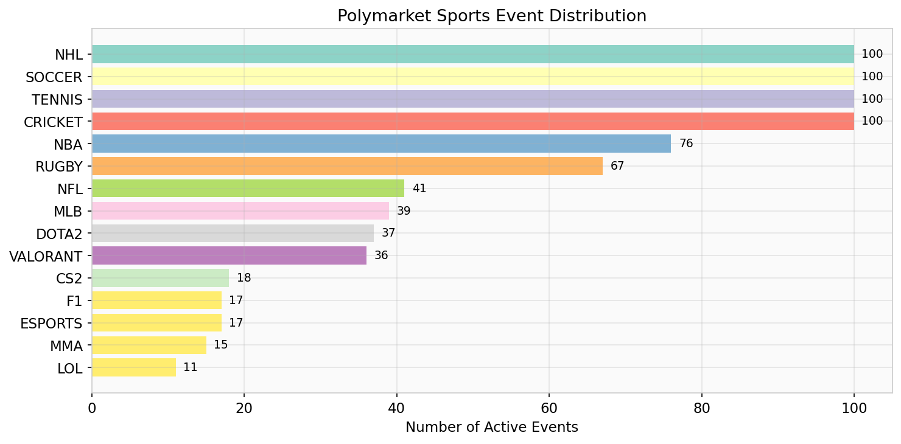

# Fetching Events

## Active Events by Sport

```python
from poly_data import GammaClient

gamma = GammaClient()

# Single sport
nba = gamma.fetch_events(active_only=True, sport_slugs=["nba"])
print(f"NBA: {len(nba)} events")

# Multiple sports
events = gamma.fetch_events(
    active_only=True,
    sport_slugs=["nba", "nfl", "mlb", "soccer"]
)
print(f"All sports: {len(events)} events (deduplicated)")
```

```
NBA: 76 events
All sports: 312 events (deduplicated)
```

!!! info "Deduplication"
    Events that appear under multiple sport slugs are automatically deduplicated by ID.

## Esports Events

```python
events = gamma.fetch_events(
    active_only=True,
    sport_slugs=["valorant", "cs2", "lol", "dota-2", "esports"]
)
print(f"Esports: {len(events)} events")

# Print first 5 titles
for ev in events[:5]:
    print(f"  • {ev['title']}")
```

```
Esports: 155 events
  • Valorant: Team Vitality vs UCAM Esports Club (BO3)
  • CS2: NAVI vs FaZe Clan — IEM Katowice 2026
  • League of Legends: T1 vs Gen.G — LCK Spring
  • ...
```

## Resolved Events (Historical)

```python
from datetime import datetime, timedelta, timezone

gamma = GammaClient()

end = datetime.now(timezone.utc).strftime("%Y-%m-%d")
start = (datetime.now(timezone.utc) - timedelta(days=30)).strftime("%Y-%m-%d")

resolved = gamma.fetch_resolved_events(
    start, end,
    sport_slugs=["nba", "mlb", "soccer"]
)
print(f"Last 30 days: {len(resolved)} resolved events")
```

## As a DataFrame

```python
df = gamma.fetch_events_df(active_only=True, sport_slugs=["nba"])

print(df.columns.tolist()[:8])
print(f"\n{len(df)} rows × {len(df.columns)} columns")
```

```
['id', 'title', 'slug', 'description', 'startDate', 'endDate', 'markets', 'tags']
76 rows × 24 columns
```

## Sport Distribution Plot

```python
import matplotlib.pyplot as plt
from poly_data import GammaClient
from poly_data.markets import detect_sport

gamma = GammaClient()
events = gamma.fetch_events(active_only=True)

# Count events per sport
sports = {}
for ev in events:
    sport = detect_sport(ev.get("title", ""), tags=ev.get("tags"))
    sports[sport] = sports.get(sport, 0) + 1

# Sort and plot
sports = dict(sorted(sports.items(), key=lambda x: x[1], reverse=True))

fig, ax = plt.subplots(figsize=(10, 5))
colors = plt.cm.Set3(range(len(sports)))
bars = ax.barh(list(sports.keys()), list(sports.values()), color=colors)
ax.set_xlabel("Number of Active Events")
ax.set_title("Polymarket Sports Event Distribution")
ax.invert_yaxis()

for bar, count in zip(bars, sports.values()):
    ax.text(bar.get_width() + 1, bar.get_y() + bar.get_height()/2,
            str(count), va="center", fontsize=9)

plt.tight_layout()
plt.savefig("sport_distribution.png", dpi=150)
plt.show()
```

{ loading=lazy }

!!! example "Sample output"
    ```
    NHL: 100, SOCCER: 100, CRICKET: 100, TENNIS: 100,
    NBA: 76, RUGBY: 67, NFL: 41, MLB: 39,
    VALORANT: 36, CS2: 18, F1: 17, MMA: 15, LOL: 11
    ```
