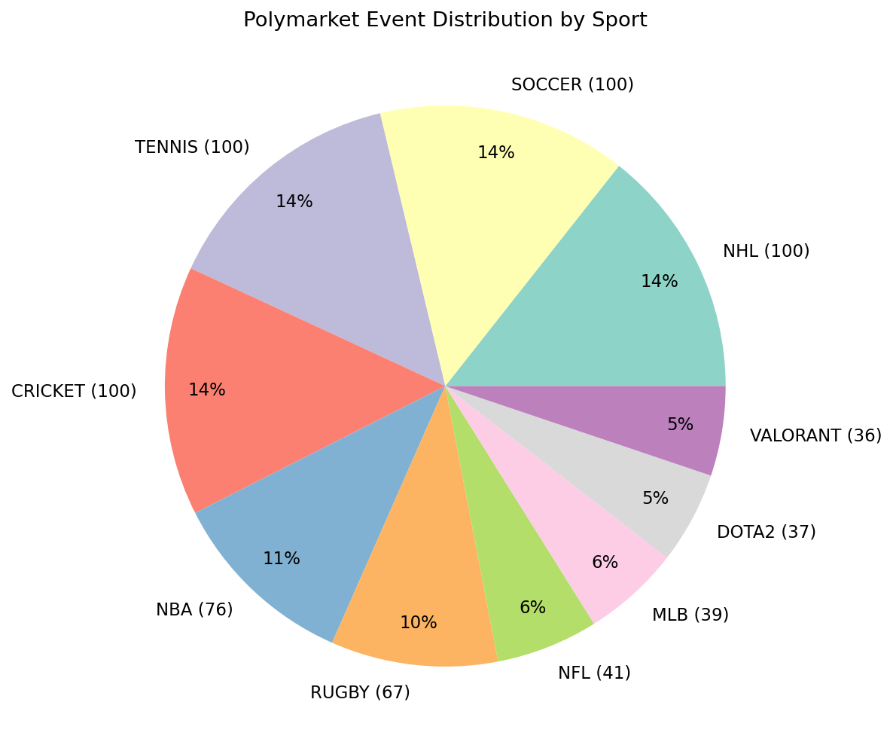

# Market Filtering

Polymarket events contain many market types — props, spreads, over/unders, partial-game. `MarketFilter` helps you keep only what matters.

## Head-to-Head Markets

```python
from poly_data import GammaClient, MarketFilter

gamma = GammaClient()
events = gamma.fetch_events(active_only=True)

h2h_total = 0
market_total = 0

for event in events:
    for market in event.get("markets", []):
        market_total += 1
        if MarketFilter.is_head_to_head(market):
            h2h_total += 1

print(f"{h2h_total} / {market_total} markets are H2H")
```

```
434 / 7174 markets are H2H
```

### What Gets Filtered Out

`is_head_to_head` excludes:

| Excluded Type | Example Question |
|---------------|-----------------|
| Props | "Will LeBron score 30+?" (Yes/No outcomes) |
| Spreads | "Spread: Lakers -5.5" |
| Over/Under | "Total Points Over/Under 220.5" |
| Partial-game | "1H: Lakers vs Pistons" |
| Non-matchups | "Which team wins the NBA Finals?" |

Only markets with **exactly 2 team-name outcomes** and a **"vs"** indicator pass.

## Soccer Match Markets

Soccer on Polymarket uses **beat/draw Yes/No** format rather than "Team A vs Team B":

```python
# Soccer markets look like:
# "Will Liverpool beat Manchester City?" → outcomes: ["Yes", "No"]
# "Will the match end in a draw?" → outcomes: ["Yes", "No"]

from poly_data import MarketFilter

market = {
    "question": "Will Liverpool beat Manchester City?",
    "outcomes": '["Yes", "No"]',
}

print(MarketFilter.is_head_to_head(market))       # False (Yes/No outcomes)
print(MarketFilter.is_soccer_match_market(market)) # True  (beat/draw + Yes/No)
```

```
False
True
```

## Esports Detection

```python
from poly_data import MarketFilter

event = {
    "title": "Valorant: Team Vitality vs UCAM Esports Club (BO3)",
    "tags": [{"label": "valorant"}, {"label": "esports"}],
}

print(MarketFilter.is_esports_event(event))  # True
```

## Combined Filtering with `should_include`

`should_include` is the one-stop filter that handles all market types:

```python
from poly_data import GammaClient, MarketFilter

gamma = GammaClient()
events = gamma.fetch_events(active_only=True)

included = []
for event in events:
    for market in event.get("markets", []):
        if MarketFilter.should_include(market, event):
            included.append((event["title"], market["question"]))

print(f"{len(included)} tradeable markets")
for title, question in included[:5]:
    print(f"  [{title[:40]}…] {question}")
```

## Sport Detection

```python
from poly_data.markets import detect_sport

# From tags (preferred — more accurate)
detect_sport("", tags=[{"label": "nba"}])                    # → "NBA"
detect_sport("", tags=[{"label": "premier-league"}])         # → "SOCCER"
detect_sport("", tags=[{"label": "valorant"}])               # → "VALORANT"
detect_sport("", tags=[{"label": "cs2"}])                    # → "CS2"
detect_sport("", tags=[{"label": "f1"}])                     # → "F1"

# From title (fallback)
detect_sport("Lakers vs Celtics — NBA")                      # → "NBA"
detect_sport("Premier League: Liverpool vs Man City")        # → "SOCCER"
detect_sport("CS2: NAVI vs FaZe Clan")                       # → "CS2"
detect_sport("Something unknown")                            # → "UNKNOWN"
```

## Sport Distribution Plot

```python
import matplotlib.pyplot as plt
from collections import Counter
from poly_data import GammaClient
from poly_data.markets import detect_sport

gamma = GammaClient()
events = gamma.fetch_events(active_only=True)

sports = Counter(
    detect_sport(ev.get("title", ""), tags=ev.get("tags"))
    for ev in events
)

# Pie chart
labels = [f"{k} ({v})" for k, v in sports.most_common(10)]
sizes = [v for _, v in sports.most_common(10)]

fig, ax = plt.subplots(figsize=(8, 8))
colors = plt.cm.Set3(range(len(labels)))
wedges, texts, autotexts = ax.pie(
    sizes, labels=labels, autopct="%1.0f%%",
    colors=colors, pctdistance=0.85
)
ax.set_title("Polymarket Event Distribution by Sport")

plt.tight_layout()
plt.savefig("sport_pie.png", dpi=150)
plt.show()
```

{ loading=lazy }

## Extract Winners from Resolved Markets

```python
from poly_data.markets import extract_winner

resolved_market = {
    "outcomes": '["Lakers", "Pistons"]',
    "outcomePrices": '[1, 0]',
}
print(extract_winner(resolved_market))  # → "Lakers"

unresolved = {
    "outcomes": '["Lakers", "Pistons"]',
    "outcomePrices": '[0.62, 0.38]',
}
print(extract_winner(unresolved))  # → None (not yet resolved)
```

## Draw Markets (Soccer)

Soccer events on Polymarket use three separate Yes/No markets for a single match.
`DrawMarketGroup` unifies them:

```python
from poly_data import GammaClient, ClobClient, DrawMarketGroup, group_draw_markets

gamma = GammaClient()
clob = ClobClient()

events = gamma.fetch_events(active_only=True, sport_slugs=["soccer"])
groups = group_draw_markets(events)
print(f"{len(groups)} complete draw-market groups")

grp = groups[0]
print(grp)                  # DrawMarketGroup(Liverpool vs Manchester City, complete)
print(grp.teams)            # ('Liverpool', 'Manchester City')

# Each sub-market has its own conditionId
print(grp.condition_ids())
# {'team_a': '0xabc…', 'team_b': '0xdef…', 'draw': '0x123…'}

# Get Yes token IDs for pricing
tokens = grp.yes_token_ids()
# {'team_a': '501319…', 'team_b': '966830…', 'draw': '443892…'}

# Fetch midpoints and compute implied probabilities
midpoints = {role: clob.fetch_midpoint(tid) for role, tid in tokens.items()}
probs = grp.implied_probabilities(midpoints)
print(f"  {grp.team_a}: {probs['team_a']:.1%}")
print(f"  {grp.team_b}: {probs['team_b']:.1%}")
print(f"  Draw:    {probs['draw']:.1%}")
print(f"  Overround: {probs['overround']:.1%}")
```

```
3 complete draw-market groups
DrawMarketGroup(Liverpool vs Manchester City, complete)
('Liverpool', 'Manchester City')
  Liverpool: 45.2%
  Manchester City: 28.8%
  Draw:    26.0%
  Overround: 103.2%
```

!!! info "Why three markets?"
    Polymarket can't represent a 3-way outcome in one market.
    Instead, each outcome (Team A Win, Team B Win, Draw) is a separate Yes/No contract.
    `DrawMarketGroup` links them so you can compute true probabilities.
