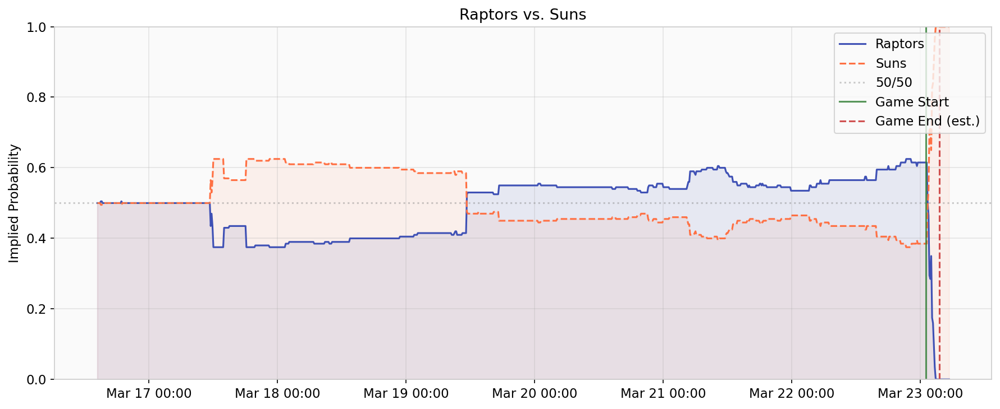
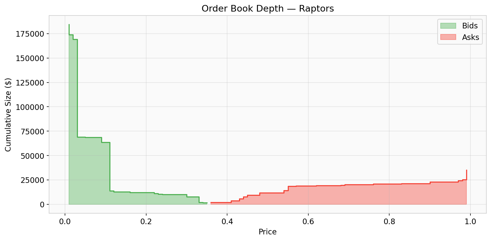
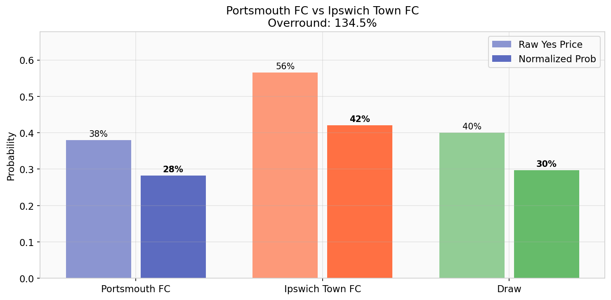
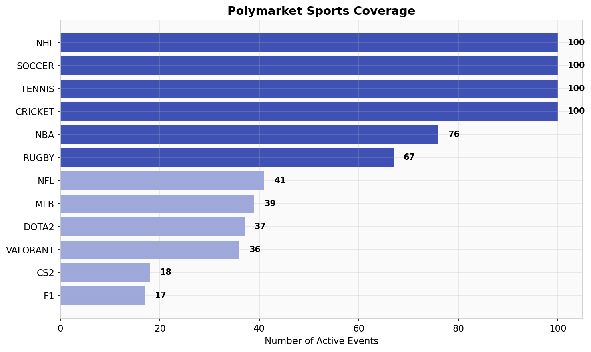
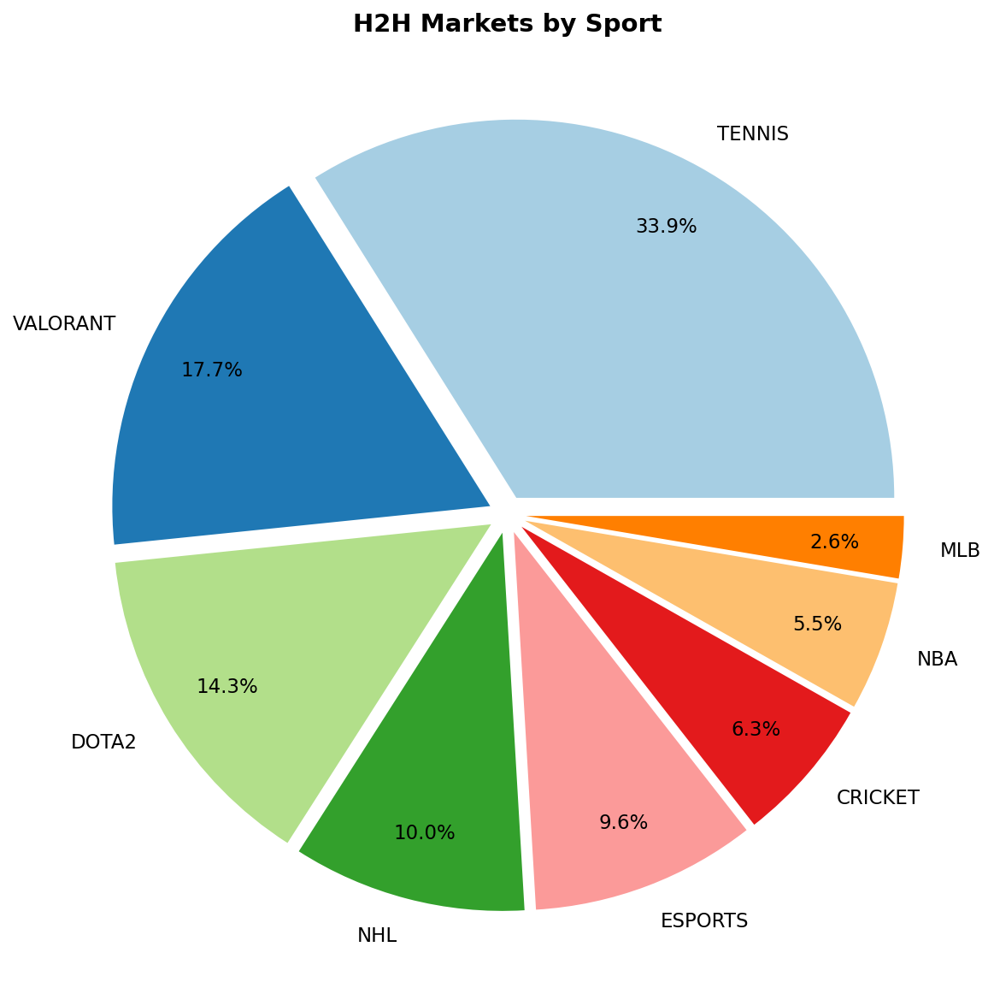
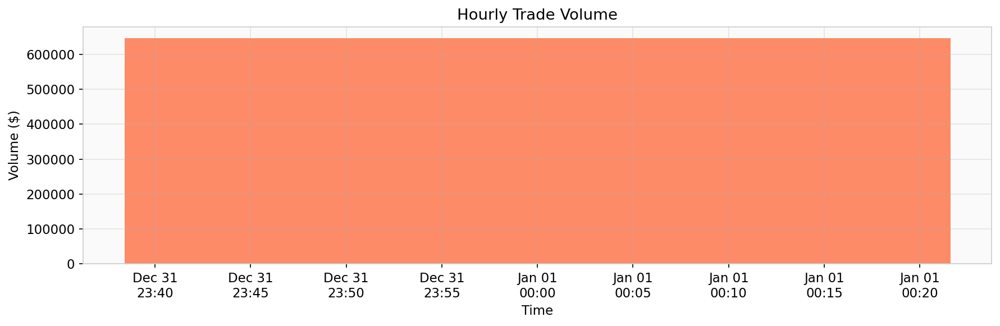

# Plotting & Visualization

Build charts from Polymarket data — price histories with game time markers, order books, sport distributions, and draw-market probabilities.

## Price History — Completed Game with ESPN Times

Plot both outcomes of a resolved game with vertical markers for game start and estimated end time from ESPN:

```python
import matplotlib.pyplot as plt
import matplotlib.dates as mdates
import pandas as pd
from poly_data import GammaClient, ClobClient, ESPNClient, MarketFilter
from poly_data.markets import parse_json_field, detect_sport
from poly_data._http import GAMMA_API, get_json

gamma = GammaClient()
clob = ClobClient()
espn = ESPNClient()

# Find a recently resolved H2H market with price history
resolved = get_json(f"{GAMMA_API}/events", params={
    "tag_slug": "nba", "closed": "true", "limit": 50,
    "order": "endDate", "ascending": "false",
})
for ev in resolved:
    for h2h in ev.get("markets", []):
        if not MarketFilter.is_head_to_head(h2h):
            continue
        tokens = parse_json_field(h2h.get("clobTokenIds") or h2h.get("tokens", []))
        outcomes = parse_json_field(h2h.get("outcomes", []))
        if len(tokens) >= 2 and len(outcomes) >= 2:
            hist = clob.fetch_price_history(str(tokens[0]))
            if len(hist) > 10:
                break
    else:
        continue
    break

# Price histories for both sides
df_a = clob.fetch_price_history_df(str(tokens[0]))
df_b = clob.fetch_price_history_df(str(tokens[1]))

# Match the game on ESPN
espn_event = espn.find_game_event(
    ev["title"], ev.get("endDate", "")[:10], "nba", search_days=3,
)

fig, ax = plt.subplots(figsize=(12, 5))
ax.plot(df_a["timestamp"], df_a["price"], linewidth=1.5,
        color="#3F51B5", label=outcomes[0])
ax.fill_between(df_a["timestamp"], df_a["price"], alpha=0.1, color="#3F51B5")

ax.plot(df_b["timestamp"], df_b["price"], linewidth=1.5,
        color="#FF7043", label=outcomes[1], linestyle="--")
ax.fill_between(df_b["timestamp"], df_b["price"], alpha=0.08, color="#FF7043")

ax.axhline(y=0.5, color="gray", linestyle=":", alpha=0.4, label="50/50")

# Game time markers from ESPN
if espn_event:
    start = pd.to_datetime(espn_event["date"], utc=True)
    ax.axvline(x=start, color="#2E7D32", linewidth=1.5, alpha=0.8, label="Game Start")

    end = espn.estimate_game_end(espn_event, "nba")
    if end:
        ax.axvline(x=pd.to_datetime(end, utc=True), color="#C62828",
                   linestyle="--", linewidth=1.5, alpha=0.8, label="Game End (est.)")

ax.set_ylim(0, 1)
ax.set_ylabel("Implied Probability")
ax.set_title(h2h["question"])
ax.xaxis.set_major_formatter(mdates.DateFormatter("%b %d %H:%M"))
ax.legend(loc="upper right")
plt.tight_layout()
plt.savefig("price_line.png", dpi=150)
plt.show()
```

{ loading=lazy }

!!! tip "Game end is estimated"
    ESPN doesn't expose an explicit end time. `estimate_game_end()` uses
    sport-specific durations (NBA ~2.5h, NFL ~3.5h) and adjusts for overtime
    periods when the ESPN event shows period > regulation.

## Cumulative Depth Chart

A single cumulative depth chart replaces the old bar-style order book:

```python
import numpy as np
import matplotlib.pyplot as plt

book = clob.fetch_orderbook(str(tokens[0]))
bids = sorted(book.get("bids", []), key=lambda x: -float(x["price"]))
asks = sorted(book.get("asks", []), key=lambda x: float(x["price"]))

bid_prices = [float(b["price"]) for b in bids]
bid_cum = list(np.cumsum([float(b["size"]) for b in bids]))
ask_prices = [float(a["price"]) for a in asks]
ask_cum = list(np.cumsum([float(a["size"]) for a in asks]))

fig, ax = plt.subplots(figsize=(10, 5))
ax.fill_between(bid_prices, bid_cum, alpha=0.4, color="#4CAF50", step="post", label="Bids")
ax.fill_between(ask_prices, ask_cum, alpha=0.4, color="#F44336", step="post", label="Asks")
ax.step(bid_prices, bid_cum, color="#4CAF50", linewidth=1.5, where="post")
ax.step(ask_prices, ask_cum, color="#F44336", linewidth=1.5, where="post")

ax.set_xlabel("Price")
ax.set_ylabel("Cumulative Size ($)")
ax.set_title(f"Order Book Depth — {outcomes[0]}")
ax.legend()
plt.tight_layout()
plt.savefig("depth_chart.png", dpi=150)
plt.show()
```

{ loading=lazy }

## Draw-Market Probability Chart

Soccer events on Polymarket have three separate Yes/No markets (Team A win, Team B win, Draw).
Use `DrawMarketGroup` to combine them and visualize raw vs. normalized probabilities:

```python
import matplotlib.pyplot as plt
from poly_data import GammaClient, ClobClient, DrawMarketGroup, group_draw_markets

gamma = GammaClient()
clob = ClobClient()

events = gamma.fetch_events(active_only=True, sport_slugs=["soccer"])
groups = group_draw_markets(events)

grp = groups[0]  # first complete draw-market group
print(f"{grp.team_a} vs {grp.team_b}")

# Fetch midpoints for each Yes token
tokens = grp.yes_token_ids()
midpoints = {}
for role, tid in tokens.items():
    midpoints[role] = clob.fetch_midpoint(tid)

probs = grp.implied_probabilities(midpoints)
labels = [grp.team_a, grp.team_b, "Draw"]
raw = [midpoints["team_a"], midpoints["team_b"], midpoints["draw"]]
normed = [probs["team_a"], probs["team_b"], probs["draw"]]

fig, ax = plt.subplots(figsize=(10, 5))
x = range(len(labels))
ax.bar([xi - 0.2 for xi in x], raw, 0.35, label="Raw Yes Price",
       color=["#5C6BC0", "#FF7043", "#66BB6A"], alpha=0.7)
ax.bar([xi + 0.2 for xi in x], normed, 0.35, label="Normalized",
       color=["#5C6BC0", "#FF7043", "#66BB6A"], alpha=1.0)

for i, (r, n) in enumerate(zip(raw, normed)):
    ax.text(i - 0.2, r + 0.01, f"{r:.0%}", ha="center", fontsize=10)
    ax.text(i + 0.2, n + 0.01, f"{n:.0%}", ha="center", fontweight="bold")

ax.set_ylabel("Probability")
ax.set_title(f"{grp.team_a} vs {grp.team_b} — Overround: {probs['overround']:.1%}")
ax.set_xticks(list(x))
ax.set_xticklabels(labels)
ax.legend()
plt.tight_layout()
plt.savefig("draw_market.png", dpi=150)
plt.show()
```

{ loading=lazy }

!!! info "What is overround?"
    The **overround** is the sum of raw Yes prices across all three outcomes.
    If it's 1.03 (103%), the market has a 3% built-in margin.
    Normalized probabilities divide by this total so they sum to 1.0.

## Sports Coverage Bar Chart

```python
from collections import Counter
from poly_data import GammaClient
from poly_data.markets import detect_sport

gamma = GammaClient()
events = gamma.fetch_events(active_only=True)

sports = Counter(detect_sport(ev.get("title", ""), tags=ev.get("tags")) for ev in events)
items = sports.most_common(12)
labels, counts = zip(*items)

fig, ax = plt.subplots(figsize=(10, 6))
colors = ["#3F51B5" if c > 50 else "#9FA8DA" for c in counts]
bars = ax.barh(labels, counts, color=colors)
for bar, count in zip(bars, counts):
    ax.text(bar.get_width() + 2, bar.get_y() + bar.get_height() / 2,
            str(count), va="center", fontweight="bold")
ax.set_xlabel("Number of Active Events")
ax.set_title("Polymarket Sports Coverage")
ax.invert_yaxis()
plt.tight_layout()
plt.savefig("sport_bars.png", dpi=150)
plt.show()
```

{ loading=lazy }

## H2H Markets by Sport (Pie)

```python
h2h_sports = Counter()
for ev in events:
    sport = detect_sport(ev.get("title", ""), tags=ev.get("tags"))
    for mkt in ev.get("markets", []):
        if MarketFilter.is_head_to_head(mkt):
            h2h_sports[sport] += 1

top = h2h_sports.most_common(8)
labels, sizes = zip(*top)

fig, ax = plt.subplots(figsize=(8, 8))
ax.pie(sizes, labels=labels, autopct="%1.1f%%",
       explode=[0.05]*len(labels), colors=plt.cm.Paired(range(len(labels))),
       pctdistance=0.82)
ax.set_title("H2H Markets by Sport")
plt.tight_layout()
plt.savefig("h2h_pie.png", dpi=150)
plt.show()
```

{ loading=lazy }

## Hourly Trade Volume

```python
from poly_data import DataAPIClient
import pandas as pd

api = DataAPIClient()
condition_id = h2h.get("conditionId") or h2h.get("condition_id")
trades = api.fetch_trades(condition_id, max_offset=1000)

df = pd.DataFrame(trades)
df["timestamp"] = pd.to_datetime(df["timestamp"], utc=True)
df["size"] = pd.to_numeric(df.get("size", df.get("match_amount", 0)), errors="coerce")
df["hour"] = df["timestamp"].dt.floor("h")
hourly = df.groupby("hour")["size"].sum().reset_index()

fig, ax = plt.subplots(figsize=(12, 4))
ax.bar(hourly["hour"], hourly["size"], width=0.03, color="#FF7043", alpha=0.8)
ax.set_xlabel("Time")
ax.set_ylabel("Volume ($)")
ax.set_title("Hourly Trade Volume")
ax.xaxis.set_major_formatter(mdates.DateFormatter("%b %d\n%H:%M"))
plt.tight_layout()
plt.savefig("trade_volume.png", dpi=150)
plt.show()
```

{ loading=lazy }
