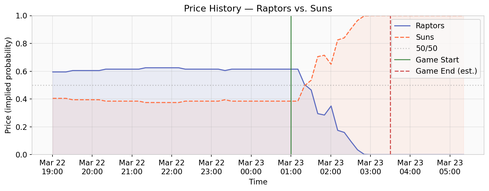

# Price Data & Order Books

## Fetch a Midpoint Price

```python
from poly_data import GammaClient, ClobClient, MarketFilter
from poly_data.markets import parse_json_field

gamma = GammaClient()
clob = ClobClient()

# Find an active H2H market and get its token IDs
events = gamma.fetch_events(active_only=True, sport_slugs=["nba"])

for event in events:
    for market in event.get("markets", []):
        if MarketFilter.is_head_to_head(market):
            # Token IDs live in 'clobTokenIds' (JSON string)
            tokens = parse_json_field(
                market.get("clobTokenIds") or market.get("tokens", [])
            )
            if tokens:
                token_id = str(tokens[0])
                mid = clob.fetch_midpoint(token_id)
                print(f"{market['question']}")
                print(f"  Token: {token_id[:20]}…")
                print(f"  Midpoint: {mid:.4f}" if mid else "  Midpoint: N/A")
                break
    else:
        continue
    break
```

```
Los Angeles Lakers vs Detroit Pistons
  Token: 50131916083478714…
  Midpoint: 0.6250
```

## Full Order Book

```python
book = clob.fetch_orderbook(token_id)

bids = book.get("bids", [])
asks = book.get("asks", [])

print(f"Bids: {len(bids)} levels")
print(f"Asks: {len(asks)} levels")

# Top of book
if bids:
    print(f"Best bid: {bids[0]['price']} × {bids[0]['size']}")
if asks:
    print(f"Best ask: {asks[0]['price']} × {asks[0]['size']}")
```

```
Bids: 12 levels
Asks: 8 levels
Best bid: 0.62 × 150.00
Best ask: 0.63 × 200.00
```

## Market Snapshot

Get midpoint, best bid/ask, depth, and last trade in one call:

```python
snapshot = clob.snapshot_market(market)

import json
print(json.dumps(snapshot, indent=2))
```

```json
{
  "condition_id": "0xf440e623…",
  "Lakers": {
    "token_id": "50131916…",
    "midpoint": 0.625,
    "best_bid": 0.62,
    "best_ask": 0.63,
    "bid_depth": 2450.0,
    "ask_depth": 1800.0,
    "last_trade_price": 0.62,
    "last_trade_size": 50.0
  },
  "Pistons": {
    "token_id": "96683032…",
    "midpoint": 0.375,
    "best_bid": 0.37,
    "best_ask": 0.38,
    "bid_depth": 1800.0,
    "ask_depth": 2450.0,
    "last_trade_price": 0.38,
    "last_trade_size": 50.0
  }
}
```

## Price History

```python
history = clob.fetch_price_history(token_id)
print(f"{len(history)} price points")

# As a DataFrame (with datetime conversion)
df = clob.fetch_price_history_df(token_id)
print(df.head())
```

```
142 price points
                 timestamp  price
0 2026-03-21 14:22:00+00:00  0.580
1 2026-03-21 15:05:00+00:00  0.592
2 2026-03-21 16:30:00+00:00  0.610
3 2026-03-21 18:45:00+00:00  0.625
4 2026-03-22 01:12:00+00:00  0.618
```

!!! warning "Price history purged after resolution"
    The CLOB `/prices-history` endpoint is **cleared after a market resolves**.
    Use `DataAPIClient.fetch_trades()` for post-resolution trade data — it survives resolution.

## Plot: Price History

```python
import matplotlib.pyplot as plt
import matplotlib.dates as mdates

df = clob.fetch_price_history_df(token_id)

fig, ax = plt.subplots(figsize=(10, 4))
ax.plot(df["timestamp"], df["price"], linewidth=1.5, color="#5C6BC0")
ax.fill_between(df["timestamp"], df["price"], alpha=0.15, color="#5C6BC0")

ax.set_ylabel("Price (probability)")
ax.set_xlabel("Time")
ax.set_title(f"Price History — {market['question']}")
ax.set_ylim(0, 1)
ax.xaxis.set_major_formatter(mdates.DateFormatter("%b %d\n%H:%M"))
ax.grid(True, alpha=0.3)

plt.tight_layout()
plt.savefig("price_history.png", dpi=150)
plt.show()
```

{ loading=lazy }

## Plot: Order Book Depth

```python
import matplotlib.pyplot as plt

book = clob.fetch_orderbook(token_id)
bids = book.get("bids", [])
asks = book.get("asks", [])

bid_prices = [float(b["price"]) for b in bids]
bid_sizes = [float(b["size"]) for b in bids]
ask_prices = [float(a["price"]) for a in asks]
ask_sizes = [float(a["size"]) for a in asks]

fig, ax = plt.subplots(figsize=(8, 4))
ax.bar(bid_prices, bid_sizes, width=0.005, color="#4CAF50", alpha=0.8, label="Bids")
ax.bar(ask_prices, ask_sizes, width=0.005, color="#F44336", alpha=0.8, label="Asks")

ax.set_xlabel("Price")
ax.set_ylabel("Size ($)")
ax.set_title("Order Book Depth")
ax.legend()
ax.grid(True, alpha=0.3)

plt.tight_layout()
plt.savefig("orderbook_depth.png", dpi=150)
plt.show()
```

{ loading=lazy }

## Post-Resolution Trade History

```python
from poly_data import DataAPIClient

api = DataAPIClient()

# Use the condition_id from the market
condition_id = market.get("conditionId") or market.get("condition_id")
trades = api.fetch_trades(condition_id, max_offset=500)
print(f"{len(trades)} trades")

# As DataFrame
df = api.fetch_trades_df(condition_id, max_offset=500)
print(df[["timestamp", "price", "size", "side"]].head())
```

```
300 trades
                     timestamp  price   size side
0 2026-03-20 09:15:22+00:00    0.55  25.00  BUY
1 2026-03-20 09:18:45+00:00    0.56  50.00  BUY
2 2026-03-20 10:02:11+00:00    0.54  30.00  SELL
3 2026-03-20 10:15:33+00:00    0.57  100.00 BUY
4 2026-03-20 11:30:08+00:00    0.58  75.00  BUY
```
